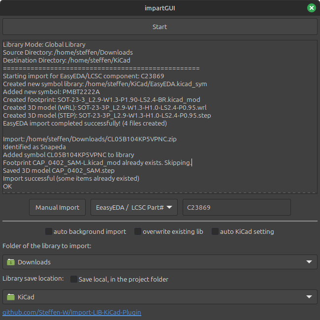
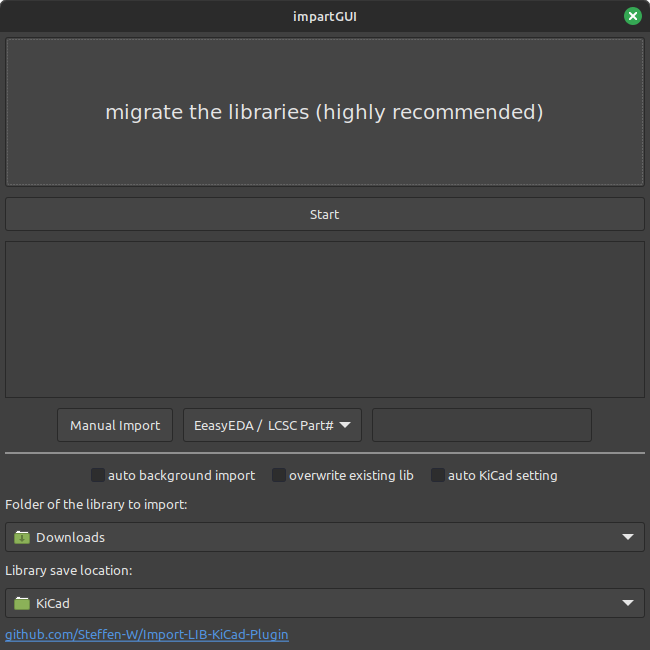
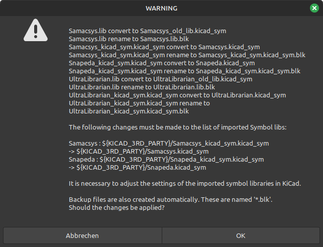
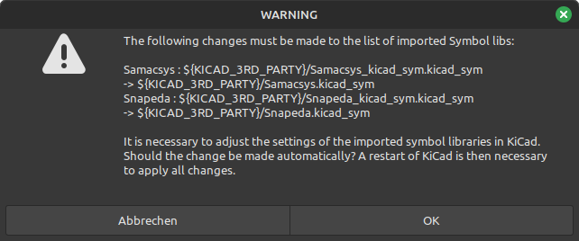
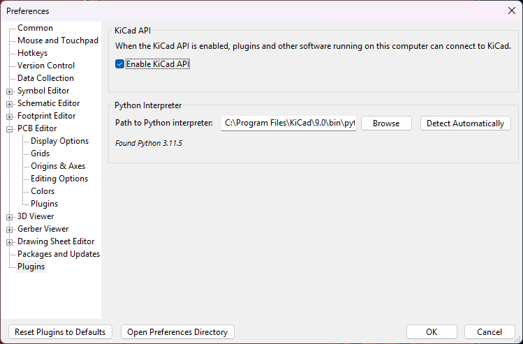

[-1e8449>)](https://componentsearchengine.com/)
[-27ae60>)](https://www.snapeda.com/home/)
[](https://app.ultralibrarian.com/search)
[](https://octopart.com/)
[](https://www.lcsc.com/)

[](https://github.com/Steffen-W/Import-LIB-KiCad-Plugin/releases/latest)
[](https://github.com/Steffen-W/Import-LIB-KiCad-Plugin/releases/latest/download/Import-LIB-KiCad-Plugin.zip)

# KiCad Import-LIB-KiCad-Plugin 

This plugin allows importing downloaded libraries from the platforms [Octopart](https://octopart.com/), [Samacsys](https://componentsearchengine.com/), [Ultralibrarian](https://app.ultralibrarian.com/search), [Snapeda](https://www.snapeda.com/home/) and [EasyEDA](https://www.lcsc.com/). It can import symbols, footprints, descriptions, and if available, 3D files. Normally, when you select the imported symbol in KiCad, the appropriate footprint and the 3D file should also be linked. Provided, of course, that the libraries have been included as specified below.

[](<[https://youtu.be/cdOKDY-F4ZU](https://youtu.be/VrWPPHtCovQ)>)

[YouTube - Instructions for installation and use](https://youtu.be/BYIKjCs1qKQ)

## Installation

Install the plugin easily through KiCad's **Plugin And Content Manager**. Select  **Import-LIB-KiCad-Plugin** in the Plugins tab, press **Install** and then **Apply Pending Changes**.

You can also download the latest version [here](https://github.com/Steffen-W/Import-LIB-KiCad-Plugin/releases/latest/download/Import-LIB-KiCad-Plugin.zip) and install it via **KiCad** -> **Plugin And Content Manager** -> **Install from File...** -> select **Import-LIB-KiCad-Plugin.zip** and import.

## Use of the application

The import window is accessible in the **PCB Editor** -> **Tools** -> **External Plugins** -> **impartGUI**



The libraries to import must be located in the folder specified as **Folder of the library** to import. After pressing Start, the libraries will be imported into the specified folder (**Library save location**).

**New:** You can also drag and drop ZIP files directly into the text area for instant import without setting up folder monitoring.

Provided that the paths have been [added correctly in KiCad](#including-the-imported-libraries-in-kicad), the parts can be used immediately in KiCad. If the libraries have not been imported correctly, a warning will indicate this.

## Including the imported libraries in KiCad

⚠️ **IMPORTANT:** Before using the plugin, you must manually configure the library paths in KiCad. The automatic configuration option may not work reliably in all cases.

**Step 1: Configure Environment Variable**

**Preferences** -> **Configure paths** -> **Environment Variables** -> Add the following entry

| Name            | Path                        |
| --------------- | --------------------------- |
| KICAD_3RD_PARTY | **YourLibraryFolder**/KiCad |

**Step 2: Add Symbol Libraries**

**Preferences** -> **Manage Symbol Libraries** -> **Global Libraries** -> Add the following entries

**Note:** Add only the libraries you plan to use. Errors will appear if you add libraries that don't exist yet - they will be created automatically when you import your first component from that source.

| Active             | Visible            | Nickname       | Library Path                                | Library Format |
| ------------------ | ------------------ | -------------- | ------------------------------------------- | -------------- |
| :heavy_check_mark: | :heavy_check_mark: | Samacsys       | ${KICAD_3RD_PARTY}/Samacsys.kicad_sym       | KiCad          |
| :heavy_check_mark: | :heavy_check_mark: | Snapeda        | ${KICAD_3RD_PARTY}/Snapeda.kicad_sym        | KiCad          |
| :heavy_check_mark: | :heavy_check_mark: | UltraLibrarian | ${KICAD_3RD_PARTY}/UltraLibrarian.kicad_sym | KiCad          |
| :heavy_check_mark: | :heavy_check_mark: | EasyEDA        | ${KICAD_3RD_PARTY}/EasyEDA.kicad_sym        | KiCad          |

**Step 3: Add Footprint Libraries**

**Preferences** -> **Manage Footprint Libraries** -> **Global Libraries** -> Add the following entries

**Note:** Add only the libraries you plan to use. As with symbol libraries, errors will appear until you import your first component.

| Active             | Nickname       | Library Path                             | Library Format |
| ------------------ | -------------- | ---------------------------------------- | -------------- |
| :heavy_check_mark: | Samacsys       | ${KICAD_3RD_PARTY}/Samacsys.pretty       | KiCad          |
| :heavy_check_mark: | Snapeda        | ${KICAD_3RD_PARTY}/Snapeda.pretty        | KiCad          |
| :heavy_check_mark: | UltraLibrarian | ${KICAD_3RD_PARTY}/UltraLibrarian.pretty | KiCad          |
| :heavy_check_mark: | EasyEDA        | ${KICAD_3RD_PARTY}/EasyEDA.pretty        | KiCad          |

**Step 4: Restart KiCad**

After adding the library paths, **restart KiCad** to ensure all settings are properly loaded.

---

**About the "auto KiCad setting" option:** While the plugin offers an automatic configuration option, it may not work reliably in all KiCad versions or configurations. If you encounter errors like "Failed to add library automatically", follow the manual steps above instead.

## Migrate the libraries

It is strongly recommended to migrate the libraries. If you see the "migrate the libraries" button, you have been using the plugin for some time. From now on, only the latest library format will be supported. If this does not work, the old format will continue to work.



By pressing "migrate the libraries" the following window appears. Depending on how many libraries you use, fewer libraries may be displayed. Now you can start the conversion process. Important: The conversion only works completely from KiCad 8.0.4. If possible, use the latest stable [](https://www.kicad.org/download/) version.



Depending on the setup, further changes may be necessary. You will be notified if this is necessary. Press ok to apply them. A restart of KiCad is mandatory to apply the changes.



## CLI Support

The import process can also be done completely without the GUI. `python -m plugins.KiCadImport -h`

```bash
usage: __main__.py [-h] (--download-folder DOWNLOAD_FOLDER | --download-file DOWNLOAD_FILE | --easyeda EASYEDA) --lib-folder LIB_FOLDER [--overwrite-if-exists] [--path-variable PATH_VARIABLE]

Import KiCad libraries from a file or folder.

options:
  -h, --help            show this help message and exit
  --download-folder DOWNLOAD_FOLDER
                        Path to the folder with the zip files to be imported.
  --download-file DOWNLOAD_FILE
                        Path to the zip file to import.
  --easyeda EASYEDA     Import easyeda part. example: C2040
  --lib-folder LIB_FOLDER
                        Destination folder for the imported KiCad files.
  --overwrite-if-exists
                        Overwrite existing files if they already exist
  --path-variable PATH_VARIABLE
                        Example: if only project-specific '${KIPRJMOD}' standard is '${KICAD_3RD_PARTY}'
```

## KiCad IPC API (Recommended)

The **KiCad IPC API** is the modern and recommended way to run this plugin. It provides automatic dependency management and better performance compared to the fallback solution.

**To activate the KiCad IPC API:**

1. **KiCad** -> **Settings** -> **Plugins** -> **Enable Plugin System**
2. Check **Enable KiCad API** option
3. Restart KiCad



**Benefits of using the KiCad IPC API:**

- Automatic dependency installation in isolated environment
- Faster startup and execution
- Better integration with KiCad
- No manual setup required

**Plugin access with IPC API:**

- **PCB Editor** -> **Tools** -> **External Plugins** -> **impartGUI (IPC API)**
- **Schematic Editor** -> **Tools** -> **External Plugins** -> **impartGUI (IPC API)**

## Fallback Solution (pcbnew)

If the **KiCad IPC API** is not available or activated, the plugin will automatically use a fallback solution. The KiCad API handles dependency installation in its own virtual environment automatically, while the fallback solution requires manual setup.

**To activate the KiCad IPC API (recommended):**
**KiCad** -> **Settings** -> **Plugins** -> **Activate KiCad API**

## Warranty

**None. Zero. Zilch. Use at your own risk**, and please be sure to use git or some other means of backing up/reverting changes caused by this script. This script will modify existing lib, dcm, footprint or 3D model files. It is your responsibility to back them up or have a way to revert changes should you inadvertently mess something up using this tool.

Please write an issues if an import does not work as requested.

## FAQ

**Do I have to manually create a library that does not yet exist before using the plugin?**
No, you do not need to create a file manually. Your only task is to download your desired part from the internet and start the import process with the plugin.

**Where can I save the library?**
It is possible to save the files in any place on your PC where you have read and write permissions.
It is also possible to store the files on network drives or cloud storage to share the library with others.
In the libraries relative paths are used, the absolute path is not considered.

**Can I change the storage location?**
Yes, this is of course always possible. But you should keep in mind that the existing libraries will not be moved automatically. You would have to do that yourself if necessary.

**If I import from one source, do I have to stay with that source, or can I import from all sources?**
For each source, a separate library is created for KiCad. Maximum actually three (Samacsys, Ultralibrarian and Snapeda), Octopart components as well as from other suppliers can be found in the Snapeda library. So if you import from a new source, a new library can be created. But maximum three.

### General KiCad Questions

**I have entered a library in the settings in KiCad that does not exist at this time, what happens?**
You get a message that this library does not exist. Nothing more. As soon as it exists, it can be accessed.

**Can I remove a library from the settings?**
Yes, you can always do that. The libraries are neither deleted nor edited in any way. They are just not included.

## Todo List

- [x] Drag and drop support for ZIP files
- [x] add as local project Lib
- [x] plugin in schematic windows
- [x] Add digikey support
- [x] Reloading the dependency pydantic for [uPesy/easyeda2kicad.py](https://github.com/uPesy/easyeda2kicad.py)
- [x] Updating the library before an import `kicad-cli sym upgrade`
- [x] Updating the footprint library `kicad-cli fp upgrade *.pretty`
- [x] add [jlcpcb parts](https://jlcpcb.com/parts) to import (integrate [uPesy/easyeda2kicad.py](https://github.com/uPesy/easyeda2kicad.py))
- [x] Automatic background import
- [x] Test on a Mac
- [x] Testing all library formats
- [x] Using the new KiCad format
- [x] Possibility of automatic KiCad settings adjustment

If you notice an error then please write me an issue. If you want to change the GUI or the functionality, I am also open for ideas.

[](https://github.com/Steffen-W/Import-LIB-KiCad-Plugin/issues/new)

<a href="https://ko-fi.com/steffenw1" target="_blank"></a>

## Development Setup

### Building the KiCad Plugin Package

```bash
# Clone repository with submodules
git clone --recurse-submodules https://github.com/Steffen-W/Import-LIB-KiCad-Plugin.git
cd Import-LIB-KiCad-Plugin

# Update to latest changes (including submodules)
git pull --recurse-submodules
git submodule update --remote --merge

# Generate KiCad plugin ZIP file
./generate_zip.sh
```

**The `generate_zip.sh` script:**

- Updates version in `metadata.json` with current date
- Packages only essential files (excludes dev files, caches, etc.)
- Creates `Import-LIB-KiCad-Plugin.zip` ready for KiCad Plugin Manager

## Many thanks to

[wexi with impart](https://github.com/wexi/impart) and [topherbuckley](https://github.com/topherbuckley/kicad_remote_import) for the code on which the GUI is based.
I would also like to thank [uPesy](https://github.com/uPesy) for enabling the import of [EasyEDA](https://www.lcsc.com/) through his python project [uPesy/easyeda2kicad.py](https://github.com/uPesy/easyeda2kicad.py) (AGPL-3.0 license).
I also thank the people who helped me find the errors in the code.
