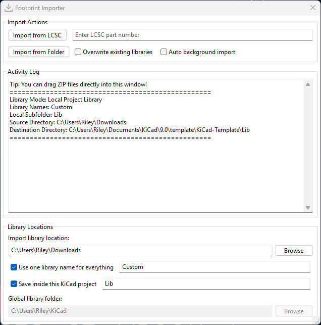

# KiCad Footprint Importer Plugin 

[-1e8449)](https://componentsearchengine.com/)
[-27ae60)](https://www.snapeda.com/home/)

> One click imports from LCSC, ultralibrarian, componentsearchengine, and snapeda.

This plugin allows importing downloaded libraries from the platforms [Octopart](https://octopart.com/), [Samacsys](https://componentsearchengine.com/), [Ultralibrarian](https://app.ultralibrarian.com/search), [Snapeda](https://www.snapeda.com/home/) and [EasyEDA](https://www.lcsc.com/). It can import symbols, footprints, descriptions, and if available, 3D files. Normally, when you select the imported symbol in KiCad, the appropriate footprint and the 3D file should also be linked. Provided, of course, that the libraries have been included as specified below.

## Highlights

- Direct EasyEDA/LCSC part import: paste an LCSC part number.
- Drag & drop ZIP archives straight into the log window.
- Import every ZIP in a folder with a single click or keep a watcher running in the background.
- Choose where libraries live: keep a global shared library or save everything inside the active project folder with `${KIPRJMOD}` paths.
- Optional single-library naming to consolidate all vendor parts into one custom-named library.

## Installation

1. Download the latest release archive from the [GitHub releases page](https://github.com/RileyCornelius/KiCad-Footprint-Importer-Plugin/releases).
2. In KiCad, open **Tools** → **Plugin and Content Manager**.
3. Choose **Install from File...**, select `KiCad-Footprint-Importer.zip`, and confirm.
4. Restart KiCad if prompted.

## Quick start

1. Launch the plugin from the **PCB Editor** via **Tools** → **External Plugins** → **Footprint Importer**.
2. Point the **Folder of the library to import** to where you keep downloaded vendor archives.
3. Click **Import from Folder** to pull in every ZIP, or drag individual archives onto the log window for a one-off import.

## Usage

### Importing download archives

1. Configure the **Vendor ZIP source folder** to match your download directory.
2. Pick a destination under **Global library folder** or switch to local-project mode (see below).
3. Click **Import all from folder** to process the directory. The status window logs each imported component.
4. Optionally enable **Watch folder for new ZIPs** to keep monitoring the folder in the background.
5. You can still drag one or more ZIP archives into the log window for immediate processing.

### Importing a single EasyEDA / LCSC component

Use the **Import single LCSC part** button to fetch a part on demand:

1. Enter an LCSC part number (for example `C2040`).
2. Toggle **Overwrite existing libraries** if you want to refresh an earlier download.
3. Press **Import single LCSC part** or hit <kbd>Enter</kbd>. The importer downloads symbols, footprints, and 3D models using `easyeda2kicad.py`.

### Choosing where libraries are stored

- Leave **Save inside this KiCad project** unchecked to maintain a global library under **Global library folder** (default: `~/KiCad`).
- Enable the checkbox to write into the active KiCad project. The plugin stores everything relative to `${KIPRJMOD}` and honours an optional subfolder.
- The status log reports the resolved path each time you switch modes.

### Customising library names

Enable **Use one library name for everything** when you want every vendor part to land in one consolidated library. Provide the desired name (for example `VendorParts`) and the importer reuses it for symbols, footprints, and 3D models.

### After each import

After each import the plugin validates your KiCad setup, automatically adds the `${KICAD_3RD_PARTY}`/`${KIPRJMOD}` environment variable as needed, and registers missing symbol/footprint libraries. Required actions appear in the log and in a confirmation dialog so you can apply them immediately. A KiCad restart is required for the changes to take effect.

## Including the imported libraries in KiCad
When you confirm the automatic setup prompt after an import, the plugin updates `${KICAD_3RD_PARTY}` and registers the generated symbol and footprint libraries for you (a KiCad restart is required). The steps below show how to perform the same configuration manually or how to double-check the result.

**Preferences** -> **Configure paths** -> **Environment Variables** -> Add the following entry
| Name            | Path                        |
| --------------- | --------------------------- |
| KICAD_3RD_PARTY | **YourLibraryFolder**/KiCad |

**Preferences** -> **Manage Symbol Libraries** -> **Global Libraries** -> Add the following entries
**(Note: Errors will show up if components weren't imported yet. The errors will disappear after importing as libraries will be created)**
| Active             | Visible            | Nickname       | Library Path                                | Library Format |
| ------------------ | ------------------ | -------------- | ------------------------------------------- | -------------- |
| :heavy_check_mark: | :heavy_check_mark: | Samacsys       | ${KICAD_3RD_PARTY}/Samacsys.kicad_sym       | KiCad          |
| :heavy_check_mark: | :heavy_check_mark: | Snapeda        | ${KICAD_3RD_PARTY}/Snapeda.kicad_sym        | KiCad          |
| :heavy_check_mark: | :heavy_check_mark: | UltraLibrarian | ${KICAD_3RD_PARTY}/UltraLibrarian.kicad_sym | KiCad          |
| :heavy_check_mark: | :heavy_check_mark: | EasyEDA        | ${KICAD_3RD_PARTY}/EasyEDA.kicad_sym        | KiCad          |

**Preferences** -> **Manage Footprint Libraries** -> **Global Libraries** -> Add the following entries
**(Note: It is best to add the library only after the import has been done with the plugin. Afterwards only the created libraries have to be imported. Lower entries are only for example.)**
| Active             | Nickname       | Library Path                             | Library Format |
| ------------------ | -------------- | ---------------------------------------- | -------------- |
| :heavy_check_mark: | Samacsys       | ${KICAD_3RD_PARTY}/Samacsys.pretty       | KiCad          |
| :heavy_check_mark: | Snapeda        | ${KICAD_3RD_PARTY}/Snapeda.pretty        | KiCad          |
| :heavy_check_mark: | UltraLibrarian | ${KICAD_3RD_PARTY}/UltraLibrarian.pretty | KiCad          |
| :heavy_check_mark: | EasyEDA        | ${KICAD_3RD_PARTY}/EasyEDA.pretty        | KiCad          |

> **Tip:** When the local project mode is active, the plugin replaces `${KICAD_3RD_PARTY}` with `${KIPRJMOD}` (plus your optional subfolder). The same entries appear under the project-specific library tables inside KiCad.

## Many thanks to

[Steffen-W](https://github.com/Steffen-W) for building the original [Import-LIB-KiCad-Plugin](https://github.com/Steffen-W/Import-LIB-KiCad-Plugin).

[wexi with impart](https://github.com/wexi/impart) and [topherbuckley](https://github.com/topherbuckley/kicad_remote_import) for the code on which the GUI is based.
I would also like to thank [uPesy](https://github.com/uPesy) for enabling the import of [EasyEDA](https://www.lcsc.com/) through his python project [uPesy/easyeda2kicad.py](https://github.com/uPesy/easyeda2kicad.py) (AGPL-3.0 license).
I also thank the people who helped me find the errors in the code.
