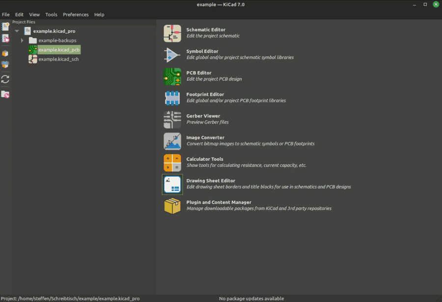
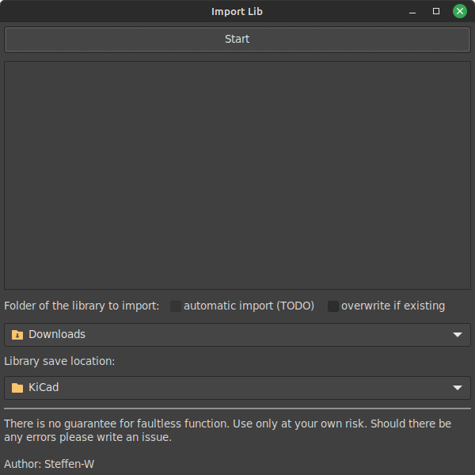

[-1e8449)](https://componentsearchengine.com/)
[-27ae60)](https://www.snapeda.com/home/)

# KiCad Import-LIB-KiCad-Plugin 

This plugin allows importing downloaded libraries from the platforms [Octopart](https://octopart.com/), [Samacsys](https://componentsearchengine.com/), [Ultralibrarian](https://app.ultralibrarian.com/search) and [Snapeda](https://www.snapeda.com/home/). It can import symbols, footprints, descriptions, and if available, 3D files. Normally, when you select the imported symbol in KiCad, the appropriate footprint and the 3D file should also be linked. Provided, of course, that the libraries have been included as specified below.

)

[YouTube - Instructions for installation and use](https://youtu.be/BYIKjCs1qKQ)

## Warranty

**None. Zero. Zilch. Use at your own risk, and please be sure to use git or some other means of backing up/reverting changes caused by this script. This script will modify existing lib, dcm, footprint or 3D model files. It is your responsibility to back them up or have a way to revert changes should you inadvertently mess something up using this tool** 

Please write an issues if an import does not work as requested.

## Installation

Install the plugin easily through KiCad's **Plugin And Content Manager**. Select  **Import-LIB-KiCad-Plugin** in the Plugins tab, press **Install** and then **Apply Pending Changes**.

You can also download the latest version [here](https://github.com/Steffen-W/Import-LIB-KiCad-Plugin/releases/latest/download/Import-LIB-KiCad-Plugin.zip) and install it via **KiCad** -> **Plugin And Content Manager** -> **Install from File...** -> select **Import-LIB-KiCad-Plugin.zip** and import.

## Use of the application

The import window is accessible in the **PCB Editor** -> **Tools** -> **External Plugins** -> **impartGUI**

The libraries to import must be located in the folder specified as **Folder of the library** to import". After pressing Start, the libraries will be imported into the specified folder (**Library save location**). Provided that the paths have been [added correctly in KiCad](#including-the-imported-libraries-in-kicad), the parts can be used immediately in KiCad. If the libraries have not been imported correctly, a warning will indicate this.

## Including the imported libraries in KiCad
To use the imported libraries from the plugin, you will need to add a couple entries to KiCad's path first to see them.

**Preferences** -> **Configure paths** -> **Environment Variables** -> Add the following entry
|Name            |Path    |
|----------------|--------|
|KICAD_3RD_PARTY |**YourLibraryFolder**/KiCad |

**Preferences** -> **Manage Symbol Libraries** -> **Global Libraries** -> Add the following entries
**(Note: Errors will show up if components weren't imported yet. The errors will disappear after importing as libraries will be created)**
|Active            |Visible           |Nickname       |Library Path                                           | Library Format |
|------------------|------------------|---------------|-------------------------------------------------------|----------------|
|:heavy_check_mark:|:heavy_check_mark:|Samacsys       |${KICAD_3RD_PARTY}/Samacsys_kicad_sym.kicad_sym        | KiCad          |
|:heavy_check_mark:|:heavy_check_mark:|Snapeda        |${KICAD_3RD_PARTY}/Snapeda_kicad_sym.kicad_sym         | KiCad          |
|:heavy_check_mark:|:heavy_check_mark:|UltraLibrarian |${KICAD_3RD_PARTY}/UltraLibrarian_kicad_sym.kicad_sym  | KiCad          |

**Preferences** -> **Manage Footprint Libraries** -> **Global Libraries** -> Add the following entries
**(Note: It is best to add the library only after the import has been done with the plugin. Afterwards only the created libraries have to be imported. Lower entries are only for example.)**
|Active             |Nickname       |Library Path                             | Library Format|
|-------------------|---------------|-----------------------------------------|---------------|
|:heavy_check_mark: |Samacsys       | ${KICAD_3RD_PARTY}/Samacsys.pretty      | KiCad         |
|:heavy_check_mark: |Snapeda        | ${KICAD_3RD_PARTY}/Snapeda.pretty       | KiCad         |
|:heavy_check_mark: |UltraLibrarian | ${KICAD_3RD_PARTY}/UltraLibrarian.pretty| KiCad         |

## Warranty

**None. Zero. Zilch. Use at your own risk**, and please be sure to use git or some other means of backing up/reverting changes caused by this script. This script will modify existing lib, dcm, footprint or 3D model files. It is your responsibility to back them up or have a way to revert changes should you inadvertently mess something up using this tool.

## FAQ

**Do I have to manually create a library that does not yet exist before using the plugin?**
No, you do not need to create a file manually. Your only task is to download your desired part from the internet and start the import process with the plugin.

**Where can I save the library?**
It is possible to save the files in any place on your PC where you have read and write permissions.
It is also possible to store the files on network drives or cloud storage to share the library with others.
In the libraries relative paths are used, the absolute path is not considered.

**Can I change the storage location?**
Yes, this is of course always possible. But you should keep in mind that the existing libraries will not be moved automatically. You would have to do that yourself if necessary.

**If I import from one source, do I have to stay with that source, or can I import from all sources?**
For each source, a separate library is created for KiCad. Maximum actually three (Samacsys, Ultralibrarian and Snapeda), Octopart components as well as from other suppliers can be found in the Snapeda library. So if you import from a new source, a new library can be created. But maximum three.

**Why are there two symbol libraries?**
In the latest version both the old and the "new" (since KiCad 6) symbol library format is imported. It is possible to prevent this by deselecting "import also old format". An automatic conversion from the old to the new format should only be done if you are an experienced KiCad user.

### General KiCad Questions

**I have entered a library in the settings in KiCad that does not exist at this time, what happens?**
You get a message that this library does not exist. Nothing more. As soon as it exists, it can be accessed.

**Can I remove a library from the settings?**
Yes, you can always do that. The libraries are neither deleted nor edited in any way. They are just not included.

## Todo List

- [ ] add [jlcpcb parts](https://jlcpcb.com/parts) to import (integrate [uPesy/easyeda2kicad.py](https://github.com/uPesy/easyeda2kicad.py)
- [ ] Updating the library before an import `kicad-cli sym upgrade`
- [ ] Updating the footprint library `kicad-cli fp upgrade *.pretty`
- [x] Automatic background import
- [x] Test on a Mac
- [x] Testing all library formats
- [x] Using the new KiCad format
- [x] Possibility of automatic KiCad settings adjustment

If you notice an error then please write me an issue. If you want to change the GUI or the functionality, I am also open for ideas.

## Many thanks to

[wexi with impart](https://github.com/wexi/impart) and [topherbuckley](https://github.com/topherbuckley/kicad_remote_import) for the code on which the GUI is based.
I also thank the people who helped me find the errors in the code.
